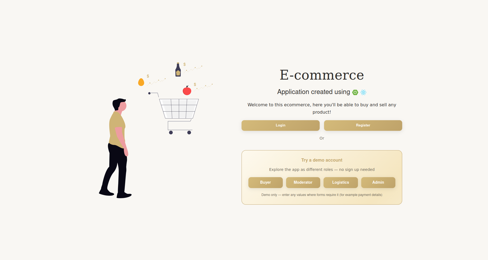
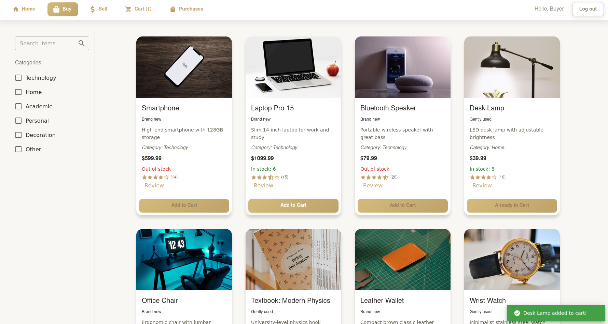
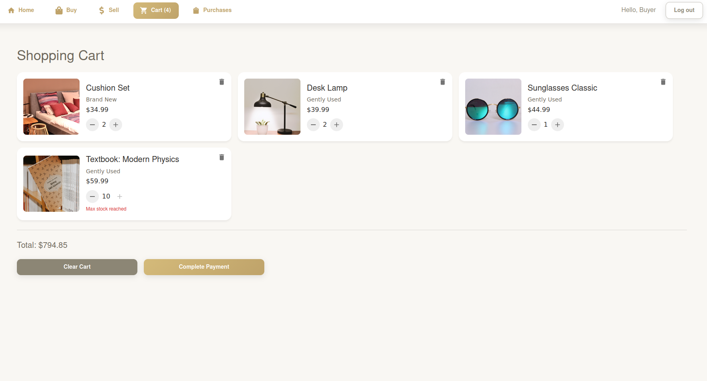
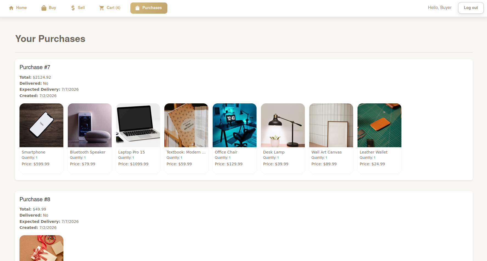
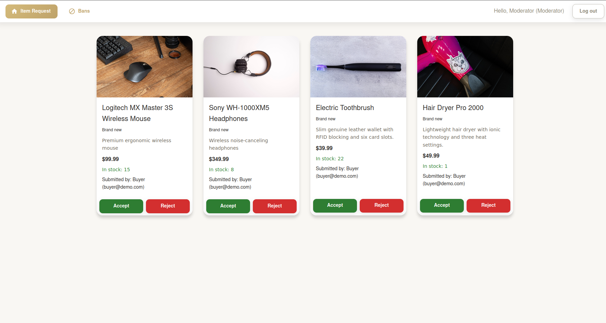
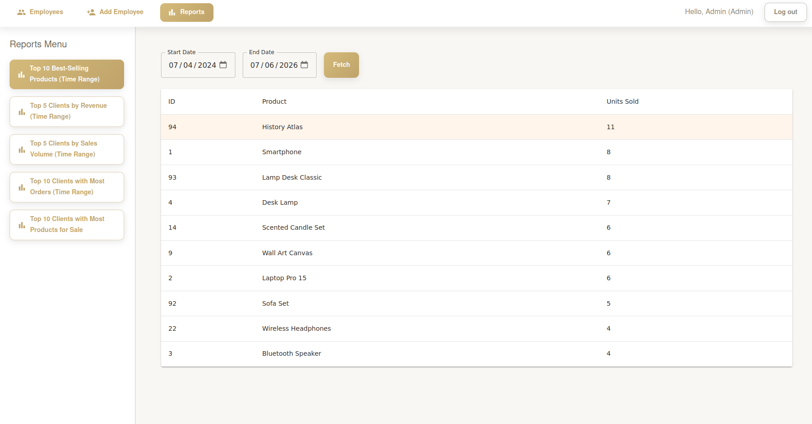

# E-Commerce Frontend

React frontend for a full-stack e-commerce platform with role-based access control. Features a buyer marketplace, seller dashboard, moderator panel, logistics management, and admin reporting.

**Live site:** https://ecommerce-cav.netlify.app  
**Backend repo:** https://github.com/cristian-ves/ecommerce-backend

> **Demo accounts — no sign up needed.** Click any role button on the landing page to log in instantly and explore the app.

| Role      | Email              | Password |
| --------- | ------------------ | -------- |
| Buyer     | buyer@demo.com     | demo1234 |
| Moderator | mod@demo.com       | demo1234 |
| Logistics | logistics@demo.com | demo1234 |
| Admin     | admin@demo.com     | demo1234 |

---

## Screenshots

### Landing page



### Buy — product marketplace



### Cart



### Purchases



### Moderator — item requests



### Admin — reports



---

## Tech Stack

| Category         | Technology           |
| ---------------- | -------------------- |
| Framework        | React 18             |
| Language         | TypeScript           |
| Build tool       | Vite 7               |
| UI library       | MUI (Material UI) v7 |
| State management | Redux Toolkit        |
| Routing          | React Router v6      |
| HTTP client      | Axios                |
| Notifications    | Notistack            |
| Alerts           | SweetAlert2          |

---

## Features by Role

### Buyer

-   Browse paginated product listings with search and category filters
-   Add products to cart with real-time optimistic UI updates
-   Manage cart — increment, decrement, remove items, clear cart
-   Checkout with saved or new payment card
-   View purchase history with item details and delivery status
-   Rate and review products

### Moderator

-   Review pending item requests submitted by sellers
-   Accept or reject items before they appear in the marketplace
-   Manage user bans — view active and banned users, toggle ban status

### Logistics

-   View all purchases across the platform
-   Mark purchases as delivered
-   Update expected delivery dates

### Admin

-   Manage employee accounts (create, edit)
-   Access reports dashboard:
    -   Top 10 best-selling products
    -   Top 5 clients by revenue
    -   Top 5 clients by sales volume
    -   Top 10 clients by order count
    -   Top 10 clients by products listed
-   All time-range reports support custom date filtering

---

## Getting Started

### Prerequisites

-   Node.js 18+
-   npm or yarn

### Local setup

**1. Clone the repo**

```bash
git clone https://github.com/cristian-ves/ecommerce-frontend
cd ecommerce-frontend
```

**2. Install dependencies**

```bash
npm install
```

**3. Configure environment**

Create a `.env.local` file at the project root (gitignored):

```env
VITE_API_URL=http://localhost:8080
```

To test against the live backend instead of local, use:

```env
VITE_API_URL=https://ecommerce-backend-f4f3.onrender.com
```

**4. Start the dev server**

```bash
npm run dev
```

App runs at `http://localhost:5173`

### Environment files

| File               | Purpose                           | Committed |
| ------------------ | --------------------------------- | --------- |
| `.env.development` | Local dev defaults                | Yes       |
| `.env.production`  | Production API URL                | Yes       |
| `.env.example`     | Documents required variables      | Yes       |
| `.env.local`       | Local overrides (never committed) | No        |

---

## Project Structure

```
src/
├── api/              — Axios instance with JWT interceptor
├── components/       — Reusable UI components by domain
│   ├── cart/
│   ├── connection/   — ConnectionOverlay for cold start UX
│   ├── items/
│   ├── main/         — Landing page components + DemoAccounts
│   ├── mod/
│   ├── purchases/
│   └── admin/
├── features/         — Redux slices and async thunks
│   ├── auth/
│   ├── cart/
│   ├── connection/
│   ├── items/
│   ├── mod/
│   ├── log/
│   ├── admin/
│   └── purchase/
├── hooks/            — Custom React hooks
├── pages/            — Page-level components by role
│   ├── auth/
│   ├── user/
│   ├── mod/
│   ├── log/
│   └── admin/
├── routes/           — Role-based routing and layouts
├── store/            — Redux store configuration
└── utils/            — Theme, date helpers
```

---

## Known Limitations

-   Payment processing is simulated — use any values in the card form (for example: 1234 1234 1234 1234, 12/29, 123)
-   Product images are external links (Pexels) and may load slowly depending on network conditions
-   Backend hosted on Render free tier — first load after inactivity may take up to 50 seconds
